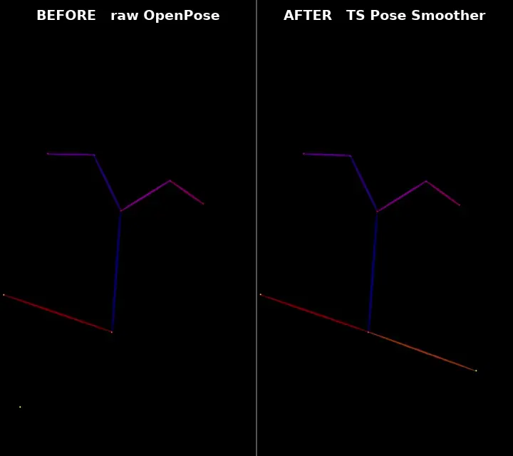
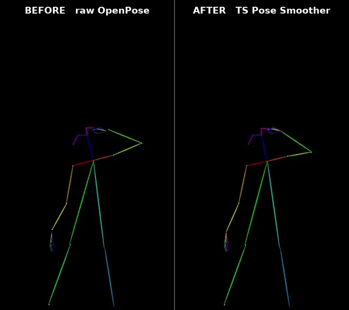

# Teskor's Utils

**Stop OpenPose from shaking.**

Raw OpenPose output jitters. Keypoints vibrate when the subject is still, joints
drop out for a frame and pop back, and a limb occasionally snaps somewhere
impossible. Feed that into ControlNet and the generated video inherits every bit
of it.

The pose smoother nodes clean the sequence before it ever reaches your
generation: temporal smoothing, gap filling, outlier rejection and subject
tracking. They support both **ViTPose/Aligned-AI `POSEDATA`** and the standard
**DWPose/OpenPose `POSE_KEYPOINT`** output from `comfyui_controlnet_aux`.

---

## See it

Same clip, same detection. Left is what OpenPose produced, right is after the node.

**Close to camera** — watch the arms and the hand clusters:



**Full body, dancing** — watch the legs and how the skeleton holds together
through fast movement:



---

## Install

**ComfyUI-Manager** — search for **Teskor's Utils**.

**Manual:**

```bash
cd ComfyUI/custom_nodes
git clone https://github.com/teskor-hub/comfyui-teskors-utils
pip install -r comfyui-teskors-utils/requirements.txt
```

Restart ComfyUI. Nodes appear under **TS Utils**.

Needs `numpy` and `opencv-python`, Python 3.9+. PyTorch is deliberately not in
`requirements.txt` — ComfyUI already ships it, and letting pip reinstall it is a
reliable way to replace a working CUDA build with a CPU one.

---

## Using it

Use the node matching the detector output:

```
ViTPose → TS Pose Data Smoother → ControlNet OpenPose → Generation
DWPreprocessor (POSE_KEYPOINT output) → TS Pose Keypoint Smoother → ControlNet OpenPose → Generation
```

Both nodes return a rendered `IMAGE` for ControlNet plus the cleaned keypoint data.
Connect the second output of `DWPreprocessor`, not its already-rendered first output,
to `TS Pose Keypoint Smoother`.

### Parameters

| Parameter | Default | What it does |
|---|---|---|
| `filter_extra_people` | `True` | Keep only the tracked subject, drop everyone else |
| `smooth_alpha` | `0.7` | Smoothing strength. Higher tracks the raw detection more closely; lower is smoother but lags behind fast motion |
| `gap_frames` | `12` | Longest dropout, in frames, that gets interpolated rather than left empty |
| `min_run_frames` | `3` | Detections that appear for fewer frames than this are treated as noise and removed |
| `conf_thresh_body` | `0.35` | Body keypoints below this confidence are ignored |
| `conf_thresh_hands` | `0.6` | Same, for hand keypoints |
| `render_resolution` | `768` | Short edge of the rendered DWPose/OpenPose control image; keeps long video batches from using the source video's full resolution |
| `force_body_18` | `False` | Force the COCO-18 skeleton layout |
| `smooth_hands` | `False` | **Experimental.** Also smooth the 21 finger keypoints |
| `smooth_face` | `True` | Smooth native DWPose/OpenPose facial landmarks while preserving the full face-point set |

If you only touch one slider, make it `smooth_alpha`. Everything else is
reasonable out of the box.

### Body and face are smoothed; fingers are optional

Worth stating plainly, because "hand jitter" means two different things:

- **Arms, elbows and wrists** are part of the body skeleton, so they go through
  the full pipeline by default — median filter, zero-lag EMA, then a
  velocity-predictive pass with a step limit. This is what removes the visible
  shaking.
- **Finger keypoints** are a separate 21-point set per hand and are left
  untouched unless you turn on `smooth_hands`.
- **Face keypoints** stay in the native DWPose/OpenPose `POSE_KEYPOINT` schema and
  are temporally smoothed by default. The renderer draws the complete landmark set
  with the same visible point sizes as `comfyui_controlnet_aux`; no ViTPose
  conversion occurs. Turn off `smooth_face` only when raw facial micro-motion is
  more important than flicker removal.

The dense-point smoother works in a body-relative coordinate frame, so moving the
head or wrist across the image is preserved while local landmark vibration is
reduced. Point counts, ordering and confidence values remain those emitted by the
original detector.

`smooth_hands` is off by default so that updating the node cannot change output
you already like.

---

## Picking the right person

When more than one person is detected, something has to decide who the video is
about. This node scores each track on how much of the clip it covers, how large
it is (closer to camera), how centrally it sits, and its mean confidence.

Predominantly single-person DWPose clips bypass whole-video track splitting. A
brief duplicate detection is resolved locally, while the sole detection in every
other frame is retained. This prevents fast close-up movement from being broken
into a short surviving track with the remaining frames rendered black.

That combination matters more than it sounds. Ranking purely by "who appears in
the most frames" loses to a steadily-detected bystander the moment the actual
subject's detection flickers — which is exactly the footage you are trying to
repair in the first place.

Measured against a synthetic sequence with a known ground-truth skeleton,
subject-tracking error went from **150.6 px to 10.2 px** — about **14.8× more
accurate**, reproduced across three random seeds. Single-subject clips are
unaffected: output is bit-identical to previous releases.

---

## Color Match Sequential Bias

The other node worth knowing about. Chunked generation drifts in brightness,
colour balance and contrast between chunks; individually invisible, in sequence
every boundary shows up as a step. `TS Color Match` measures the drift between
consecutive chunks and corrects it.

| Parameter | Default | What it does |
|---|---|---|
| `chunk_size` | `81` | **Must match your generation chunk size.** 81-frame chunks → set 81 |

```
WanVideo Animate Embeds → Combine Frames → TS Color Match → Save Video
```

---

## Also included

Small utilities that come along for the ride:

| Node | Purpose |
|---|---|
| `TS Pose Data Smoother` | Smooth ViTPose/Aligned-AI `POSEDATA` |
| `TS Pose Keypoint Smoother` | Smooth standard DWPose/OpenPose `POSE_KEYPOINT` and render it for ControlNet |
| `TS Rename Files In Dir` | Renumber a folder into a clean sequence. Has `dry_run` — use it first |
| `TS Save Pose Data` | Cache `POSEDATA` to disk as `.npz` |
| `TS Load Pose Data` | Load it back, so you can iterate on generation without re-running detection |

### Pose cache format

Pose files are `.npz`. Earlier releases wrote pickles, which is an
arbitrary-code-execution format — the load node reads from ComfyUI's `input`
folder, so a pose file shared by anyone else ran with your permissions. Those
pickles also embedded the absolute install path of ComfyUI-WanAnimatePreprocess
as a module name, so they silently broke whenever that pack moved.

Existing `.pkl` caches are not read any more. Re-save them through the node, or
ask in an issue for the one-off converter script.

`TS Rename Files In Dir` rewrites names on disk. It refuses to write outside the
target directory, renames in two phases so a new name cannot collide with a
not-yet-processed old one, and rolls back if anything fails. Still — run it with
`dry_run` first.

---

## Example workflows

In [`example workflows/`](example%20workflows/):

- `openpose smoother example.json` — the smoother on its own
- `wanvideo work flow teskor utils + kijai example.json` — full WanVideo pipeline
  alongside Kijai's nodes

---

## License

MIT — see [LICENSE](LICENSE).
